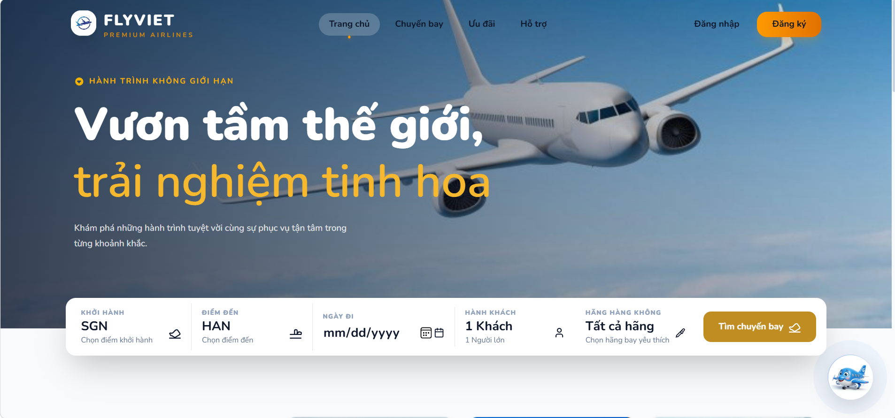
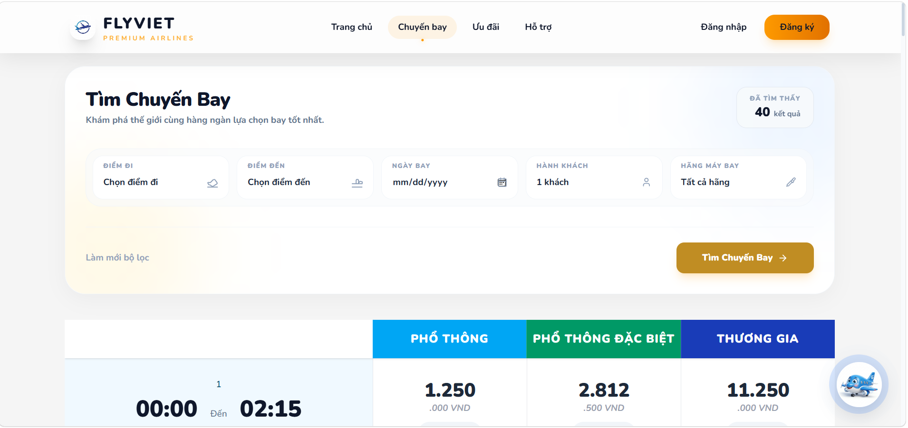
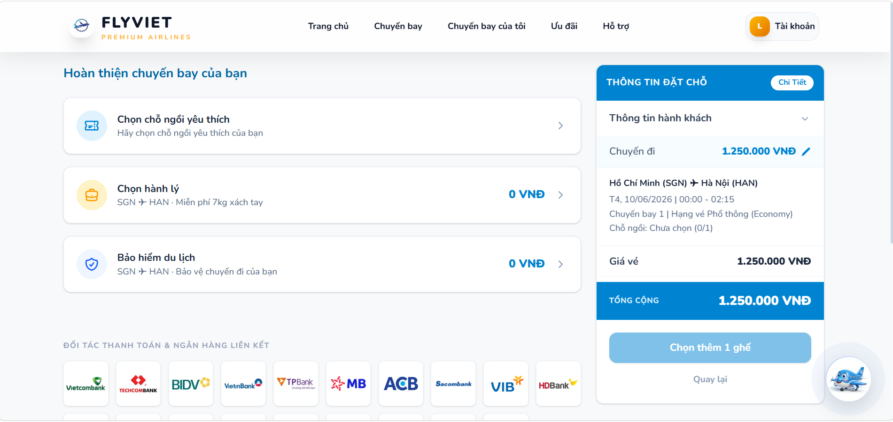
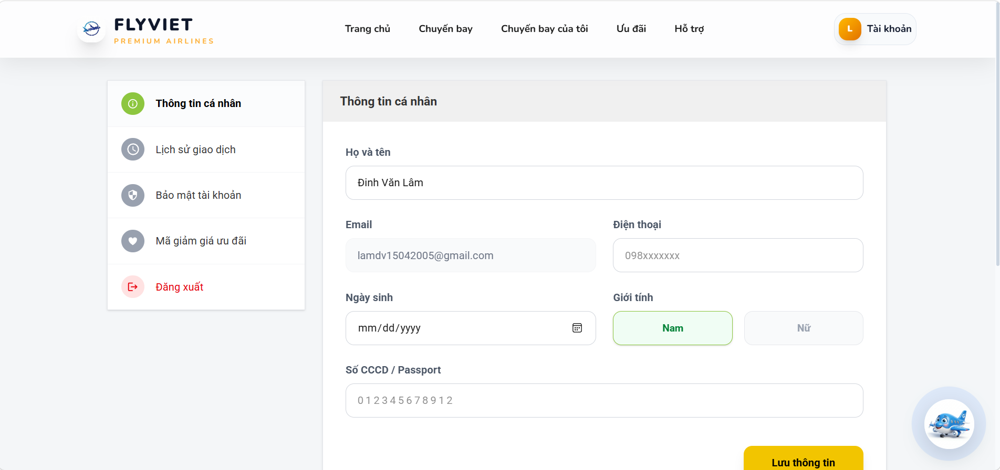
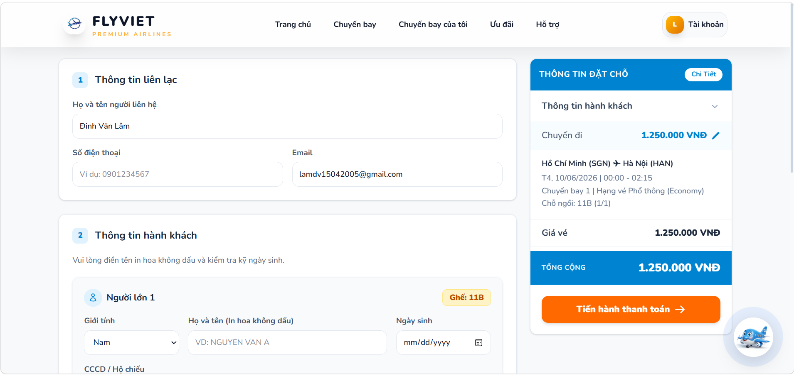
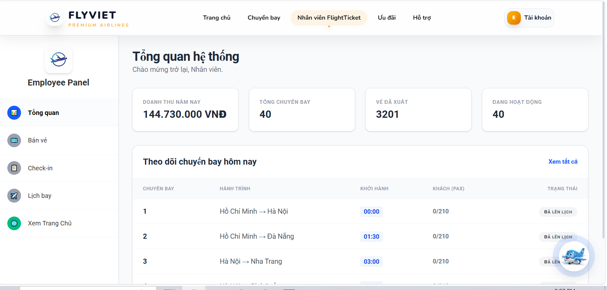
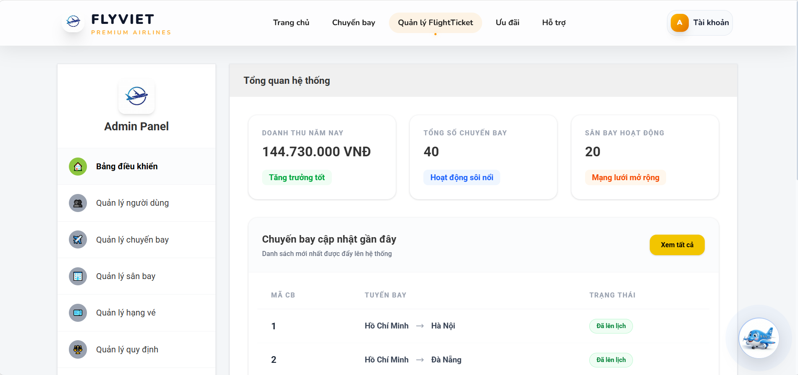
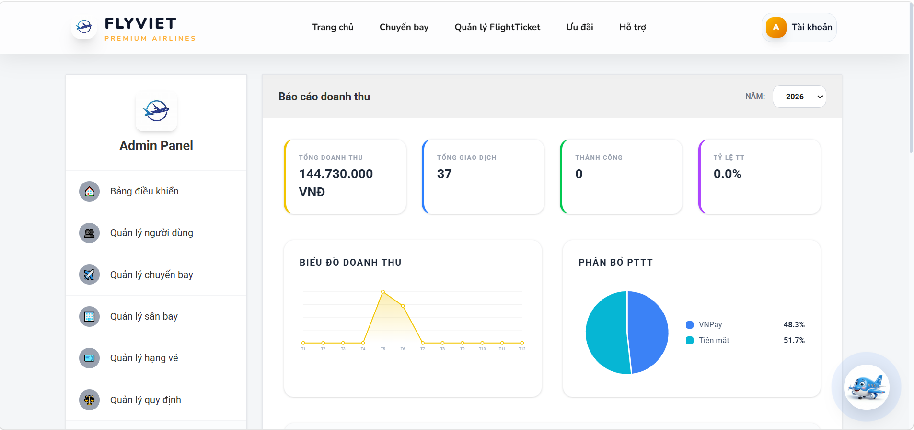
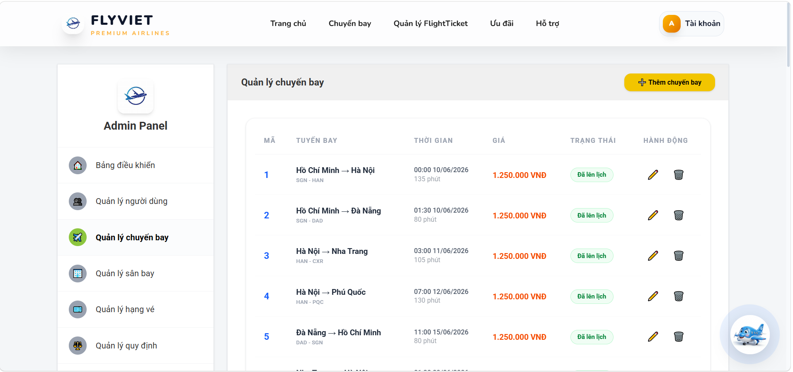

# ✈️ Airplane Ticket Booking System

Hệ thống quản lý và đặt vé máy bay trực tuyến toàn diện, tích hợp trí tuệ nhân tạo (AI) và cổng thanh toán hiện đại. Được phát triển với kiến trúc, tách biệt rõ ràng giữa Backend (Spring Boot) và Frontend (React).

---

## 🖼️ Ảnh minh họa giao diện

Dưới đây là các hình ảnh thực tế từ hệ thống Airplane Ticket Booking:

### 🏠 Giao diện Khách hàng (Client)

| **Trang chủ** | **Tìm kiếm & Chọn chuyến bay** |
| :---: | :---: |
|  |  |

| **Chi tiết chuyến bay** | **Thông tin cá nhân** |
| :---: | :---: |
|  |  |

| **Quản lý đơn hàng (Vé)** |
| :---: |
|  |

### 👨‍💼 Giao diện Nhân viên (Employee)

| **Bảng điều khiển nhân viên** |
| :---: |
|  |

### 🛡️ Giao diện Quản trị (Admin)

| **Bảng điều khiển Admin** | **Thống kê doanh thu** |
| :---: | :---: |
|  |  |

| **Quản lý chuyến bay (Admin)** |
| :---: |
|  |

---

## 🚀 Tính năng chính

| Phân hệ | Tính năng |
| :--- | :--- |
| **Khách hàng** | Tìm kiếm chuyến bay, Đặt vé, Chọn chỗ ngồi, Thanh toán VNPay, Nhận vé PDF qua Email. |
| **Thanh toán** | Tích hợp cổng VNPay (Sandbox) hỗ trợ thẻ nội địa và QR Code. |
| **AI Support** | Chatbot thông minh hỗ trợ 24/7, hiểu ngữ cảnh và dữ liệu chuyến bay. |
| **Quản trị** | Quản lý chuyến bay, máy bay, hãng hàng không, người dùng và báo cáo doanh thu. |
| **Hệ thống** | Bảo mật JWT, gửi email thông báo, xuất hóa đơn/vé PDF chuyên nghiệp. |

---

## 🛠️ Công nghệ cốt lõi

- **Backend:** Java 17, Spring Boot, Spring Security, JWT, JPA/Hibernate.
- **Frontend:** React.js (Vite), Tailwind CSS, Axios.
- **Database:** MySQL.
- **AI Integration:** OpenRouter (DeepSeek Chat/Gemini).
- **DevOps:** Docker, Docker Compose.

---

## 📂 Cấu trúc thư mục

```text
Airplane_Ticket/
├── be/                 # Backend: Spring Boot Project
├── fe/                 # Frontend: React.js Project
├── assets/             # Hình ảnh tài liệu (Screenshots)
├── docker-compose.yml  # Cấu hình khởi chạy Docker (Full-stack)
├── Dockerfile.be       # Dockerfile cho Spring Boot
├── Dockerfile.fe       # Dockerfile cho React (Production/Dev)
└── FlightTicket.sql    # Script khởi tạo cơ sở dữ liệu
```

---

## 🐳 Hướng dẫn chạy bằng Docker (Chi tiết)

Sử dụng Docker là cách nhanh nhất để khởi chạy toàn bộ hệ thống mà không cần cài đặt môi trường phức tạp.

### 1. Chuẩn bị
- Đảm bảo đã cài đặt **Docker Desktop** trên máy tính.
- Mở file `.env` (nếu có) hoặc kiểm tra file `docker-compose.yml` để đảm bảo các biến môi trường chính xác.

### 2. Cấu hình Database trong Docker
Trong `docker-compose.yml`, backend được cấu hình để kết nối với MySQL trên máy host thông qua:
`SPRING_DATASOURCE_URL=jdbc:mysql://host.docker.internal:3306/FlightTicket`

> [!IMPORTANT]
> Bạn cần đảm bảo MySQL đang chạy trên máy Windows (Port 3306) và đã chạy file `FlightTicket.sql`.

### 3. Khởi chạy hệ thống
Mở terminal tại thư mục gốc và chạy:
```bash
# Build và chạy các container trong background
docker-compose up --build -d
```

### 4. Kiểm tra trạng thái
```bash
# Xem các container đang chạy
docker ps

# Xem log của backend để kiểm tra lỗi kết nối DB
docker logs -f spring_backend
```

### 5. Truy cập ứng dụng
- **Frontend:** [http://localhost:5173](http://localhost:5173)
- **Backend API:** [http://localhost:8080](http://localhost:8080)
- **Swagger UI (nếu có):** [http://localhost:8080/swagger-ui/index.html](http://localhost:8080/swagger-ui/index.html)

---

## 🔑 Biến môi trường (Environment Variables)

Hệ thống yêu cầu các biến môi trường sau để hoạt động đầy đủ:

| Biến | Mô tả | Ví dụ |
| :--- | :--- | :--- |
| `SPRING_DATASOURCE_URL` | Đường dẫn kết nối MySQL | `jdbc:mysql://...` |
| `AI_API_KEY` | Key từ OpenRouter/DeepSeek | `sk-or-v1-...` |
| `VNP_TMNCODE` | Mã định danh VNPay | `TC123456` |
| `VNP_HASHSECRET` | Chuỗi bí mật VNPay | `SECRET_KEY...` |

---

## 🛠️ Khắc phục sự cố (Troubleshooting)

- **Lỗi kết nối Database:** Nếu chạy Docker mà Backend báo không kết nối được MySQL, hãy kiểm tra quyền truy cập của `root` trong MySQL (cho phép kết nối từ mọi host hoặc `host.docker.internal`).
- **Lỗi AI Chatbot:** Đảm bảo `AI_API_KEY` của bạn còn hạn và đúng định dạng.
- **Cài đặt thư viện Frontend:** Nếu chạy local, hãy luôn chạy `npm install` trước khi `npm run dev`.

---
